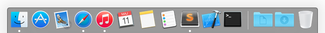

# OS X Setup guide

## 1. Update **App Store** software

Make sure that everything on the Mac is up to date either by opening **App Store** and going to **Update** tab or by running software update from terminal using this command:
```
softwareupdate -l
```

If there's something to update you'll have to run this command to update it:
```
sudo softwareupdate -iva
```

## 2. Install Xcode and Command Line Tools

To be able do do anything _programming-related_ you'll have to install **Xcode** and **Command Line Tools**. To do it follow the steps below:

1. Go to **App Store** and install **Xcode** (free software section).
2. After the installation is complete open **Xcode** and accept **terms and conditions** (**NECESSARY :bangbang:**)
3. Open terminal and install **Command Line Tools** (or if you wish to install them from _Xcode_ :arrow_right: _Preferences_ :arrow_right: _Locations_):
```
xcode-select --install
```

> To check if **Command Line Tools** were successfully installed on your machine you can simply type `gcc` in terminal and you should see some something useful like `clang: error: no input files`. 

**Note**:
Solution described above is _okay_, but you can use something better for installing Xcode and Command Line Tools.
You have to check a great tool called [`xcode-install`](https://github.com/neonichu/xcode-install). So, let's just jump into this:
```
sudo gem install xcode-install
```
After this you can get a list of available Xcodes by calling:
```
xcversion list
```
And if you want to install Xcode, simply call
```
xcversion install "version here e.g. 7.0 GM seed"
```
It'll take a looooooong, long time and ask you for password **twice**, so be patient because it's worth the hustle! 🔫
You can also use this CLI tool to install Command Line Tools itself or Simulators.

## 3. Install dotfiles

To install **dotfiles** and it's dependencies go to `$HOME` directory and run:
```
git clone https://github.com/cojoj/dotfiles.git .dotfiles
```

than change directory to the `.dotfiles` and simply run:
```
source bootstrap.sh
```

Of course you can easily use each file without calling `bootstrap.sh`.

## 4. Allow third-party software

To avoid some complication during the installation process you'll have to enable installation of third party software. To do this follow bullet points:

- Go to **Preferences**.
- Go to **Security...**.
- Select **Allow software downloaded from unknown sources**.

## 5. Terminal window configuration

To have complete **Terminal.app** configuration you have to download custom theme and install it. I use [Tomorrow Night](https://github.com/ChrisKempson/Tomorrow-Theme) with **Menlo 12pt**.

What's more, to complete setting up open **Terminal.app** preferences and there's a couple of things to set...

- **General** tab:
    + New window with profile: **Tomorrow Night**
- **Profiles** tab:
    + Set Tomorrow Night as default (at the bottom of table view)
    + Text:
        + Font is **Menlo Regular 12pt**
        + **Text** - everything selected here
        + **Cursor**:
            * Square
            * Blinking
            * **30%** opacity
    + Window:
        * **Active process**
        * **Background** - 90% opacity and 30% blur
    + Advanced:
        * Bell:
            - Visual signal only

## Sublime Text configuration

First of all let's start with linking cool `subl` shell alias so we can easily manipulate everything from Terminal.app:
```
ln -s /Applications/Sublime\ Text.app/Contents/SharedSupport/bin/subl /usr/local/bin/subl
```

With this you should be ready to go with **Sublime Text 3**. First, install **Package Control** to be able to use awesome third party plugins:

- access console by _View_ :arrow_right: _Show Console_ 😁
- paste this snippet into console:  
```
import urllib.request,os,hashlib; h = '462d6673ebd5b9ca297474c166b2e10d' + 'fd945a23b1a0642535aa906951315f52'; pf = 'Package Control.sublime-package'; ipp = sublime.installed_packages_path(); urllib.request.install_opener( urllib.request.build_opener( urllib.request.ProxyHandler()) ); by = urllib.request.urlopen( 'http://packagecontrol.io/' + pf.replace(' ', '%20')).read(); dh = hashlib.sha256(by).hexdigest(); print('Error validating download (got %s instead of %s), please try manual install' % (dh, h)) if dh != h else open(os.path.join( ipp, pf), 'wb' ).write(by)
```

List of installed packages (_might be outdated_):

- API Blueprint
- BracketHighlighter
- DashDoc
- Emmet
- Emoji
- Git
- Github Tools
- Markdown Extended
- Markdown Preview
- MarkdownEditing
- Marked App Menu
- Objective-C Autocompletion
- Package Control
- Pretty JSON
- Pretty Ruby
- RSpec
- SideBarEnhancements
- sublimelint
- SublimeLinter-annotations
- SublimeLinter-json
- SublimeLinter-ruby
- Swift
- Tomorrow Color Scheme

Theme is set to [Tomorrow Night](https://github.com/ChrisKempson/Tomorrow-Theme) with **Menlo 12pt**.

## Xcode configuration

First of all install [Alcatraz](http://alcatraz.io) using:
```
curl -fsSL https://raw.githubusercontent.com/supermarin/Alcatraz/master/Scripts/install.sh | sh
```

Here's the list of **Xcode plugins** which you use:

- AdjustFontSize
- ClangFormat
- DBSmartPanels
- DerivedData Exterminator
- FixCode
- FuzzyAutocomplete
- GitDiff
- HOStringSense
- IntelliPaste
- KSImageNamed
- Lin
- OMColorSense
- OMQuickHelp
- OpenWithApplication
- PrettyPrintJSON
- RealmPlugin
- SCXcodeSwitchExpander
- SwiftCodeSnippets
- VVDocumenter-Xcode
- Xcode_beginning_of_line
- XcodeBoost
- XcodeWay

If some plugins doesn't work it's probably because of new Xcode version and you need to update **UUID**. You can simply do it by running script in this [Gist](https://gist.github.com/b70e2ff44f26677caa02).
Simplest way to do this is byt typing:
```
curl -fsSL https://gist.githubusercontent.com/cojoj/b70e2ff44f26677caa02/raw/3ff466263de923d3574a2326896675932b222467/update_xcode_plugins | sh   
```

Beside installing plugins you'll have to install defult **theme** and set some **properties** manually. Follow the steps listed below:

- **Fonts and Colors**:
    + `Tomorrow Night` theme can be installed via **Alcatraz**
- **Text Editing**:
    + Show **Line Numbers**
    + Page guide at column
- **Source Control**:
    + Refrsh server status automatically

You're almost ready... One last thing - **code snippets**. There're two reasonable repos offering nice set of snippets:

1. [Mattt's Objective-C snippets](https://github.com/Xcode-Snippets/Objective-C)
2. [Swift snippets from Kamil Burczyk](https://github.com/burczyk/XcodeSwiftSnippets)

I've copied those repos and put them under `xcode/snippets`. To use all of those just call:
```
cp ~/.dotfiles/xcode/snippets/* ~/Library/Developer/Xcode/UserData/CodeSnippets/
```

## Dock

Please see the screenshot below for the default **Dock** icons positioning. Feel free to do it whatever you like your icons grouped.



For **Documents** and **Downloads** directories in Dock I've set this options:

- Sort by **add date**
- Show as **directory**
- Show content **automaticaly**

## Third-party software and App Store

Other tools which cannot be istalled using  **Homebrew Cask** need to be installed manually. Most of them via App Store.
